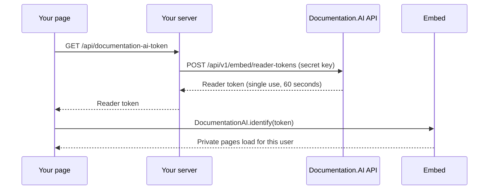

If your docs site has private pages, the embed needs to know that a user is signed in to your product. Your server vouches for each user with your embed key's **secret key**, and the embed signs them in to your docs. Users never see a sign-in prompt, whatever sign-in your docs site uses: password, JWT or OAuth 2.0.

<Callout kind="info">
  Public docs don't need any of this. If your [Access Control](/customize/access-control/overview) mode is **Public**, the publishable key is all you need.
</Callout>

## How it works

1. Your server keeps the embed key's secret key (`sk_...`).
2. When a signed-in user opens your page, your server asks Documentation.AI for a **reader token** for them.
3. Your page passes the reader token to `DocumentationAI.identify()`.
4. The embed exchanges it for a docs session, and private pages load.



## Before you start

- Your docs site uses **Private** or **Partial** access with [Password](/customize/access-control/password), [JWT](/customize/access-control/jwt) or [OAuth 2.0](/customize/access-control/oauth) sign-in.
- You have an embed key and its secret key. The secret key is shown only once, when you create the key. If you've lost it, open the key's menu in **Settings > Embed** and choose **Rotate secret key** to get a new one.

## Step 1: Store the secret key on your server

Keep the secret key where only your server can read it, such as an environment variable named `DOCUMENTATION_AI_SECRET_KEY`.

<Callout kind="danger">
  Never put the secret key in a web page, a mobile app or a public repository. The API refuses requests that come from a browser. If the secret key was ever exposed, [rotate it](#rotate-or-revoke).
</Callout>

## Step 2: Add an endpoint that returns a reader token

Add an endpoint to your server that only signed-in users can call. It asks the Documentation.AI API for a reader token and returns it as plain text.

<CodeGroup>
```javascript Node.js
// An Express route. Your own sign-in check (requireSignedIn) runs first.
app.get('/api/documentation-ai-token', requireSignedIn, async (req, res) => {
  const response = await fetch('https://api.documentation.ai/api/v1/embed/reader-tokens', {
    method: 'POST',
    headers: {
      Authorization: `Bearer ${process.env.DOCUMENTATION_AI_SECRET_KEY}`,
      'Content-Type': 'application/json',
    },
    // Optional. Only JWT and OAuth sites with role-based access use accessRoles.
    body: JSON.stringify({ accessRoles: req.user.docsRoles }),
  });
  if (!response.ok) return res.sendStatus(502);

  const { token } = await response.json();
  res.set('Cache-Control', 'no-store').type('text/plain').send(token);
});
```

```python Python
# A Flask route.
@app.get("/api/documentation-ai-token")
@login_required  # Your own sign-in check.
def documentation_ai_token():
    response = requests.post(
        "https://api.documentation.ai/api/v1/embed/reader-tokens",
        headers={"Authorization": f"Bearer {os.environ['DOCUMENTATION_AI_SECRET_KEY']}"},
        # Optional. Only JWT and OAuth sites with role-based access use accessRoles.
        json={"accessRoles": current_user.docs_roles},
        timeout=10,
    )
    response.raise_for_status()
    return response.json()["token"], 200, {"Content-Type": "text/plain", "Cache-Control": "no-store"}
```

```bash cURL
curl -X POST https://api.documentation.ai/api/v1/embed/reader-tokens \
  -H "Authorization: Bearer $DOCUMENTATION_AI_SECRET_KEY" \
  -H "Content-Type: application/json" \
  -d '{"accessRoles": ["admin"]}'
```
</CodeGroup>

A reader token works once, within 60 seconds, and only with the embed key whose secret key created it. Create a new one every time your page asks, and don't let the response be cached.

## Step 3: Sign users in from your page

Call `identify()` with a fresh reader token whenever your user is signed in:

```js
async function signInToDocs() {
  const response = await fetch('/api/documentation-ai-token'); // Your endpoint from step 2
  if (response.ok) DocumentationAI.identify(await response.text());
}

// On every page load while your user is signed in, and right after they sign in:
signInToDocs();

// When their docs session ends, sign them in again with a fresh token:
DocumentationAI.on('identity-required', signInToDocs);

// When your user signs out of your product:
DocumentationAI.signOut();
```

<Callout kind="tip">
  Call `identify()` before you place widgets, or pass the token to `init()` as `identity`, so the first page load is already signed in. A later call reloads open docs pages once.
</Callout>

## What users see

| Situation | What the user sees | Event |
| --- | --- | --- |
| Not signed in, public page | The page | None |
| Not signed in, private page | **Sign in to view this page** | `auth-required` |
| Signed in, and allowed to see the page | The page | None |
| Signed in, but their roles don't include the page | **You don't have access to this page** | `access-denied` |
| Their docs session has ended | Public pages only, until you call `identify()` again | `identity-required` |

See [Events](/ai/embed-reference#events) to react to these in your own code.

## Choose which pages each user sees

On **JWT** and **OAuth 2.0** sites with [role-based access control](/customize/access-control/overview#role-based-access-control), the `accessRoles` you send in step 2 decide which private pages a user can open. The rules are the same as for sign-in on your docs site: a page tagged with `access-roles` needs at least one matching role, and the role `*` opens every page.

**Password** sites don't use roles. Every signed-in user sees every private page, and any `accessRoles` you send are ignored.

## How long sessions last

| Your docs site's sign-in | A user stays signed in for |
| --- | --- |
| Password | 7 days |
| JWT | Your JWT **Session duration** (14 days by default) |
| OAuth 2.0 | Your OAuth session duration (7 days by default) |

When a session ends, the `identity-required` event fires once and the user sees public pages until you call `identify()` again. The code in step 3 does this for you.

## Already using JWT sign-in?

On JWT sites, you can pass `identify()` a JWT signed with the private key from **Settings > Access Control**, the same token you create for [JWT sign-in](/customize/access-control/jwt) on your docs site. Reader tokens work on JWT sites too, so use whichever is easier. On password and OAuth sites, use a reader token.

## Rotate or revoke

- **Rotate the secret key** if it may have been exposed, or on a regular schedule. In **Settings > Embed**, open the key's menu and choose **Rotate secret key**. The old secret key stops working at once, so update your server with the new one. Users who are already signed in stay signed in until their session ends.
- **Revoke the key** to stop the embed completely. Every page using it stops loading the docs and the AI Assistant within a few minutes. This can't be undone.

## Reader token API

```http
POST https://api.documentation.ai/api/v1/embed/reader-tokens
```

Call it from your server only.

<ParamField header="Authorization" param-type="string" required="true">
  Your embed key's secret key: `Bearer sk_...`
</ParamField>

The JSON body is optional. Fields the API doesn't know are ignored.

<ParamField body="accessRoles" param-type="string[]" required="false">
  The user's roles, for JWT and OAuth 2.0 sites with role-based access control. Up to 50 roles, each 1 to 100 characters.
</ParamField>

<ParamField body="firstname" param-type="string" required="false">
  The user's first name. Up to 200 characters.
</ParamField>

<ParamField body="company" param-type="string" required="false">
  The user's company. Up to 200 characters.
</ParamField>

A successful request returns `200`:

```json
{ "token": "rt_...", "expiresIn": 60 }
```

`expiresIn` is in seconds. Errors return a JSON body with `statusCode`, `error` and `message`:

| Status | Why | What to do |
| --- | --- | --- |
| `400` | A field in the body is invalid, such as a name longer than 200 characters. | Check the limits above. |
| `401` | The `Authorization` header is missing or isn't `Bearer sk_...`, the secret key is wrong, or its embed key is revoked or expired. | Check the environment variable on your server. Rotate the secret key, or create a new embed key. |
| `403` | The request came from a browser (it had an `Origin` header). | Call the API from your server only. If the secret key was in a page, rotate it. |
| `429` | More than 1,000 reader tokens in a minute for this embed key. | Wait the number of seconds in the `Retry-After` header, then try again. |
