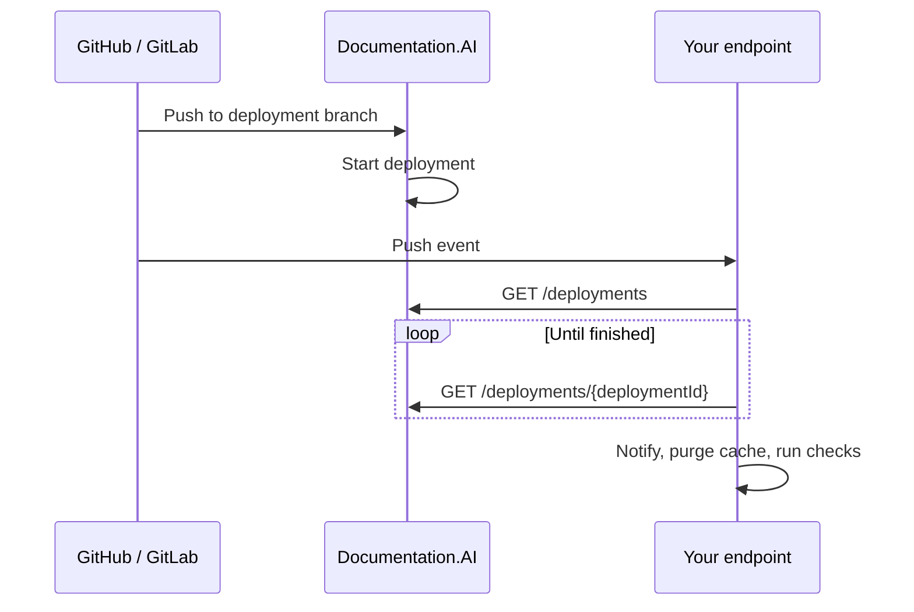

## Overview

Deployment webhooks let your own systems react when your documentation goes live: post to Slack, purge a CDN cache, run link checks, or unblock a release pipeline.

Documentation.AI deploys your live site whenever a commit lands on your deployment branch (usually `main`). A deployment webhook follows that commit through to the finished deployment:

1. Your Git provider sends a push event to your endpoint when the deployment branch changes.
2. Your endpoint finds the deployment that the push started, using the [Deployments API](/api-reference/overview#deployments).
3. Your endpoint polls that deployment until it is `ready`, `error`, or `cancelled`, then runs your own logic.



Every commit on the deployment branch reaches your endpoint, whether it came from a direct push, a merged pull request, or a publish from the web editor.

## Before you start

<Callout kind="info" collapsed="false">
  - A documentation project connected to [GitHub](/integrations/github) or [GitLab](/integrations/gitlab)
  - A Documentation.AI plan with REST API access (Standard or above)
  - An API key from **Settings → API Keys**. A **Viewer** key is enough, because the endpoint only reads deployments. See [Getting Your API Key](/api-reference/overview#getting-your-api-key).
  - Permission to add webhooks to the repository: admin on GitHub, Maintainer on GitLab
  - An HTTPS endpoint that your Git provider can reach
</Callout>

## Set up the webhook

Generate a random secret first. You'll give the same value to your Git provider and to your endpoint, so the endpoint can reject requests that don't come from your repository.

```bash
openssl rand -hex 32
```

<Tabs>
  <Tab title="GitHub" icon="github">
    <Steps>
      <Step title="Open webhook settings" icon="settings" title-type="p">
        In your repository, go to **Settings → Webhooks** and click **Add webhook**.
      </Step>

      <Step title="Point it at your endpoint" icon="link" title-type="p">
        - **Payload URL**: your endpoint, for example `https://hooks.example.com/webhooks/docs`
        - **Content type**: `application/json`
        - **Secret**: the secret you generated
      </Step>

      <Step title="Choose the push event" icon="git-commit" title-type="p">
        Select **Just the push event**, keep **Active** checked, and click **Add webhook**.

        GitHub sends push events for every branch. Your endpoint ignores all but the deployment branch.
      </Step>
    </Steps>
  </Tab>

  <Tab title="GitLab" icon="gitlab">
    <Steps>
      <Step title="Open webhook settings" icon="settings" title-type="p">
        In your project, go to **Settings → Webhooks** and click **Add new webhook**.
      </Step>

      <Step title="Point it at your endpoint" icon="link" title-type="p">
        - **URL**: your endpoint, for example `https://hooks.example.com/webhooks/docs`
        - **Secret token**: the secret you generated
      </Step>

      <Step title="Choose push events" icon="git-commit" title-type="p">
        Under **Trigger**, select **Push events** and set the branch filter to **Wildcard pattern** with your deployment branch, such as `main`. Keep SSL verification on and click **Add webhook**.
      </Step>
    </Steps>
  </Tab>
</Tabs>

<Callout kind="tip" collapsed="false">
  Use a webhook you create yourself, as shown here. Don't edit or reuse the webhook Documentation.AI registers on your repository, which it needs to deploy your site.
</Callout>

## Handle the push event

When the push event arrives, your endpoint follows the deployment it started.

<Steps>
  <Step title="Verify the request" icon="shield-check" title-type="p">
    Reject requests that don't carry your secret. GitHub signs the body in the `X-Hub-Signature-256` header, and GitLab sends the secret as-is in the `X-Gitlab-Token` header.
  </Step>

  <Step title="Check the branch" icon="git-branch" title-type="p">
    Continue only when `ref` in the payload is your deployment branch, such as `refs/heads/main`. On GitHub, this is where pushes to other branches are ignored.
  </Step>

  <Step title="Respond right away" icon="reply" title-type="p">
    Return a `2xx` response straight away and do the rest in the background. Git providers stop waiting after about 10 seconds, and a deployment takes longer.
  </Step>

  <Step title="Find the deployment" icon="search" title-type="p">
    Call [`GET /deployments`](/api-reference/get-deployments). Deployments come back newest first. Pick the first one where `isPreview` is `false`, `branch` is your deployment branch, and `createdAt` is no more than a minute before the push event arrived.

    ```bash
    curl "https://api.documentationai.app/api/v1/deployments?limit=10" \
      -H "Authorization: Bearer dai_your_api_key"
    ```

    Documentation.AI receives the same push, so the deployment can appear slightly before or after your event arrives. If there's no match yet, try again every few seconds for up to a minute.
  </Step>

  <Step title="Poll until it finishes" icon="refresh-cw" title-type="p">
    Call [`GET /deployments/{deploymentId}`](/api-reference/get-deployments-deploymentid) every 10 seconds or so until `status` is `ready`, `error`, or `cancelled`.

    ```bash
    curl https://api.documentationai.app/api/v1/deployments/9f1c2e64-3b47-4a8d-91f5-7c2e0a6d5b31 \
      -H "Authorization: Bearer dai_your_api_key"
    ```
  </Step>

  <Step title="Run your own logic" icon="zap" title-type="p">
    Once the deployment is finished, notify your team, purge caches, or continue your release pipeline.
  </Step>
</Steps>

<Callout kind="alert" collapsed="false">
  Run the endpoint somewhere that can keep working after it responds, such as a container, a VM, or a background job queue. Most serverless functions stop when the response is sent or after a few seconds, which ends the polling before the deployment finishes.
</Callout>

## The finished deployment

A finished deployment from [`GET /deployments/{deploymentId}`](/api-reference/get-deployments-deploymentid) looks like this:

```json
{
  "deploymentId": "9f1c2e64-3b47-4a8d-91f5-7c2e0a6d5b31",
  "status": "ready",
  "url": "https://docs.acme.com",
  "branch": "main",
  "isPreview": false,
  "triggerType": "auto",
  "logs": null,
  "createdAt": "2026-09-18T10:04:12.000Z",
  "updatedAt": "2026-09-18T10:06:47.000Z"
}
```

| Field                     | Description                                                                                                       |
| ------------------------- | ----------------------------------------------------------------------------------------------------------------- |
| `status`                  | `ready` when the site is live, `error` when the build failed, `cancelled` when it was stopped                     |
| `url`                     | Where the documentation is published                                                                              |
| `branch`                  | The branch that was deployed                                                                                      |
| `logs`                    | Why the deployment failed, when `status` is `error`                                                               |
| `createdAt` / `updatedAt` | When the deployment started and when it last changed. For a finished deployment, `updatedAt` is when it finished. |

## Polling and rate limits

Every request counts against your API key's per-minute limit. Polling every 10 seconds makes about six requests a minute while a deployment builds, which fits comfortably in most limits. If you poll more often, or share the key with other scripts, watch the `x-ratelimit-remaining` header and back off on `429` responses. See [Rate Limiting](/api-reference/overview#rate-limiting).

## Redeploys without a commit

A redeploy started with [`POST /deploy`](/api-reference/post-deploy) doesn't create a commit, so no push event reaches your endpoint. `POST /deploy` returns the `deploymentId` directly, so the script that started the redeploy can poll it without the lookup step.

## Troubleshooting

<ExpandableGroup>
  <Expandable title="The endpoint returns 401" default-open="false">
    The secret in your Git provider doesn't match the one your endpoint checks. On GitHub, also check that the content type is `application/json` and that nothing between the provider and your endpoint, such as a proxy or body-parsing middleware, changes the request body before the signature is checked.
  </Expandable>

  <Expandable title="No deployment is found for a push" default-open="false">
    Check that the push was to your deployment branch and that auto-deploy is working: the push should appear under deployments in the Documentation.AI dashboard. If your server's clock is off, make sure it syncs with NTP, because the lookup compares timestamps.
  </Expandable>

  <Expandable title="Several pushes in quick succession" default-open="false">
    Deployments of the same documentation run one at a time, in order. When pushes arrive within a minute of each other, an endpoint call can follow the deployment of a later push rather than its own. That deployment includes the earlier commits, so a `ready` status still means your change is live.
  </Expandable>

  <Expandable title="The API returns 401 or 403" default-open="false">
    The API key is missing, expired, or revoked. Create a new key under **Settings → API Keys** and update your endpoint's configuration.
  </Expandable>

  <Expandable title="GitHub shows failed deliveries" default-open="false">
    Open the webhook's **Recent Deliveries** tab to see the response your endpoint returned. The endpoint should answer with a `2xx` status within a few seconds, for every branch. You can redeliver any event from that tab.
  </Expandable>
</ExpandableGroup>
